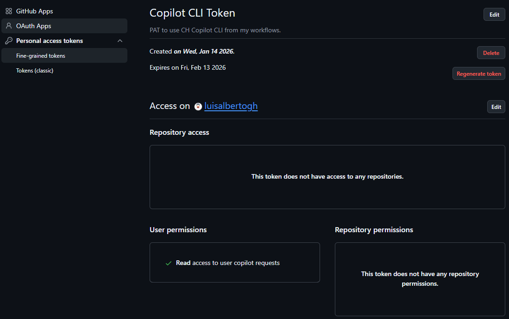
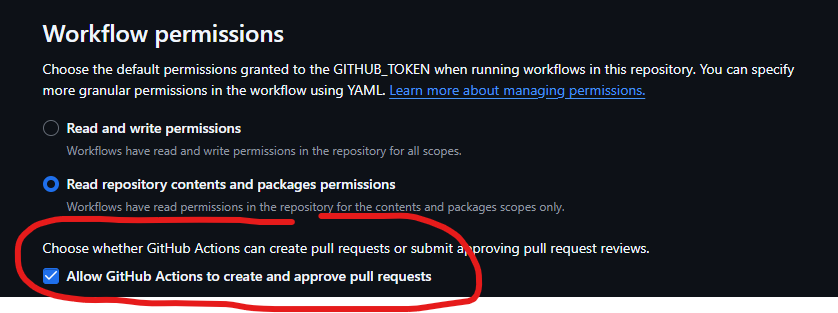

# smart-menu-planner :calendar:

Menu planner  with Copilot and custom agents.

## Overview

Smart Menu Planner is an intelligent menu planning application that leverages advanced AI agents and Copilot integration to help users create, organize, and optimize meal plans. Designed for flexibility and ease of use, it streamlines the process of planning weekly menus, generating shopping lists, and adapting to dietary preferences.

## Features

- **AI-Powered Menu Planning**: Utilizes AI agents to generate balanced and diverse meal plans based on user preferences and dietary restrictions.
- **Copilot Integration**: Seamlessly integrates with GitHub Copilot to enhance the planning process with intelligent suggestions and automation.
- **Customizable Dietary Preferences**: Allows users to specify dietary needs, allergies, and ingredient restrictions to tailor meal plans accordingly.
- **Automated Shopping Lists**: Generates comprehensive shopping lists based on the planned meals, making grocery shopping more efficient.
- **Recipe Management**: Stores and organizes recipes for easy access and reference.
- **Version Control**: Uses GitHub workflows to manage changes and updates to meal plans and recipes.

## Getting started

The planner is intended for usage from a **GitHub workflow**. Nevertheless, the AI agent can be used with Copilot *locally* as well.

To use it locally:

1. Clone the repository:

   ```bash
   git clone https://github.com/luisalbertogh/smart-menu-planner.git
   cd smart-menu-planner
   ```

2. Copy the `.github/agents/chef.agent.md` to your own Copilot or AI agents repository or location for further usage with Copilot or any other compatible AI agent.
3. Customize the agent as needed to fit your specific requirements.

## GitHub setup

To use it as a GitHub workflow, the following must be considered:

- A `PAT` (personal access token) must be created and granted with the required permissions for Copilot CLI. `Fine-grained access tokens` is recommended. `Read access to Copilot requests` is the only needed permissions:
  
- To enable the creation of `Pull Requests` from GitHub actions, the setting `Settings > Actions > General > Workflow permissions > Allow GitHub Actions to create and approve pull requests` must be checked:
  
- A secret named `COPILOT_GITHUB_TOKEN` must be added to the repository. It will contain the previosuly generated <u>PAT for Copilot</u>. For other operations, like branch creation or PR requests, the existing default GitHub token (`secrets.GITHUB_TOKEN`) for the repository will be used.

## GitHub workflow operations

If the workflow is used, the following steps are performed. The workflow can be executed, `either manually or scheduled` based on an existing cron expression.

1. **Install Copilot CLI** and the required Node version.
2. **Clean up old menu plans**. The previous menu plans are used to avoid repetitions in the menu preparation. We will only keep a determine number of previous menu plans, so a first clean up of the oldest plans and recipes is required as an initial step.
3. **Set up Git configurations** for Git operations.
4. **Create and checkout a local feature branch** where the new menu plan and recipes will be dumped.
5. **Invoke Copilot**. Use a predefined LLM model and custom Chef agent. Wait for some seconds to complete the generation of a new menu plan and the corresponding recipes and list of ingredients.
6. **Push the new files** and the new branch.
7. **Create a new PR** for further approval and merge.

Additionally, **any log file generated during the process is attached as artifacts** to the workflow. The artifacts will expire automatically <u>after 7 days</u>.
